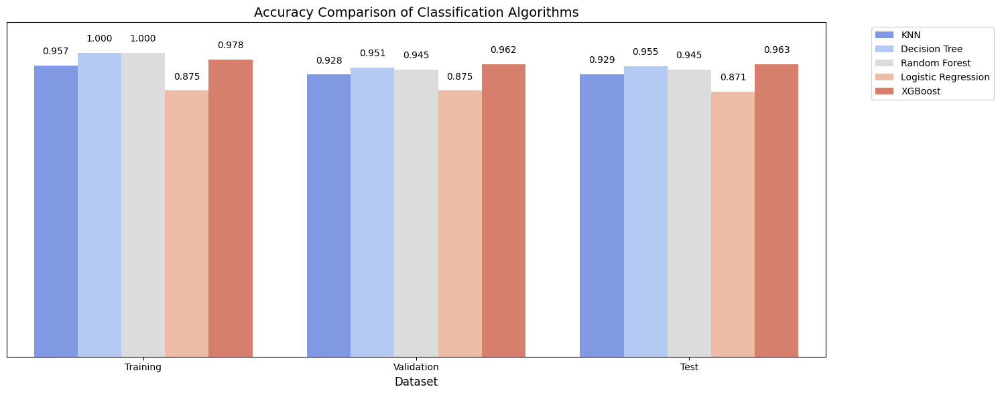
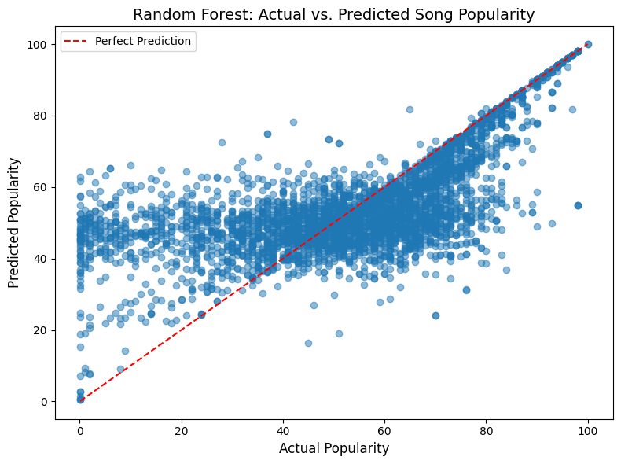
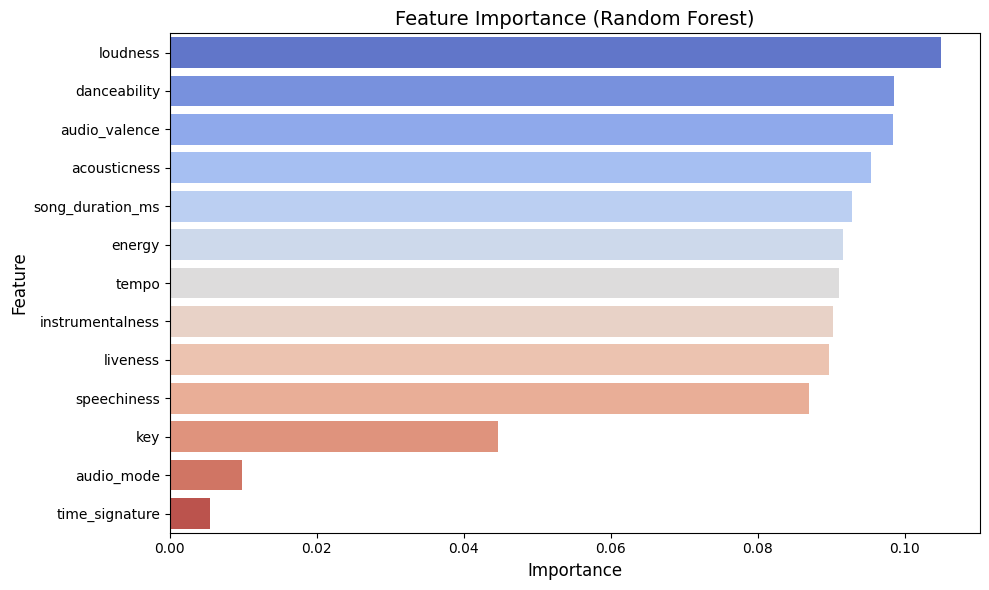

# Machine Learning Essay
 
 
 

# Index
- [1. Business Problem](#Business_Problem)
	- [1.1. Description](#Description)
	- [1.2. Objective](#Objective)
	- [1.3. Repository Structure](#Repository_Structure)
- [2. Solution Planning](#Solution_Planning)
	- [2.1. End Product](#End_Product)
	- [2.2. Tested Algorithms](#Tested_Algorithms)
		- [2.2.1. Classification](#Classification)
		- [2.2.2. Regression](#Regression)
		- [2.2.3. Clustering](#Clustering)
- [3. Development](#Development)
	- [3.1. Solution Strategy](#Solution_Strategy)
- [4. Results](#Results)
	- [4.1. Classification Results](#Classification_Results)
	- [4.2. Regression Results](#Regression_Results)
	- [4.3. Clustering Results](#Clustering_Results)
- [5. Top Insights](#Top_Insights)
	- [5.1. Insights #1](#Classification_Insight)
	- [5.2. Insights #2](#Regression_Insight)
	- [5.3. Insights #3](#Clustering_Insight)
- [6.  Conclusion](#Conclusion)
- [7.  Next Steps](#Next_Steps)
- [8.  How to Run the Notebooks](#How_to_Run)

---

## 1. Business Problem

### 1.1. Description

Welcome to my Machine Learning Essay! As a newly hired Data Scientist at **Data Money** (fictional data science consulting firm), I'm excited to showcase my work on three distinct projects that highlight the breadth of our expertise and the versatility of machine learning in solving real-world problems. 

At Data Money, we're a team of passionate data scientists who partner with clients across industries to unlock the power of data and drive impactful results.  Whether it's optimizing customer experiences, predicting market trends, or discovering hidden patterns in complex datasets, we leverage cutting-edge machine learning techniques to provide actionable insights and solutions tailored to each client's unique needs. 

### 1.2. Objective

This repository showcases my exploration of core machine learning techniques through three projects, each addressing a distinct business challenge:

* **Acquire hands-on experience:**  I've implemented and evaluated a diverse range of ML algorithms for classification, regression, and clustering, gaining practical experience in applying these techniques to real-world scenarios. 
* **Rigorously assess and compare performance:**  Through systematic experimentation and analysis, I've assessed the strengths and weaknesses of various algorithms, uncovering insights into which methods are best suited for specific tasks.
* **Translate technical findings into actionable insights:**  By interpreting results and drawing meaningful conclusions, I've transformed raw data into valuable business intelligence, demonstrating the power of data science to inform strategic decision-making.

### 1.3. Repository Structure

This repository contains three Jupyter Notebooks, each representing a unique Data Money consulting project:

- **[`classification.ipynb`](https://github.com/Daniel-ASG/Intro_ML_CDS/blob/main/Classification.ipynb)**: Predicting Customer Satisfaction - We partner with a leading airline to develop a model that predicts customer satisfaction based on travel experiences, enabling proactive service improvements and personalized offerings.
- **[`regression.ipynb`](https://github.com/Daniel-ASG/Intro_ML_CDS/blob/main/Regression.ipynb)**: Forecasting Song Popularity - We collaborate with a major music streaming platform to build a model that predicts song popularity based on audio features, empowering artists and labels to make strategic decisions about production, marketing, and playlist curation.
- **[`clustering.ipynb`](https://github.com/Daniel-ASG/Intro_ML_CDS/blob/main/Clustering.ipynb)**:  Unveiling Wine Preferences - We team up with a renowned wine producer to segment their portfolio and identify key characteristics that drive consumer preferences, guiding product development and marketing strategies.
  

## 2. Solution Planning

### 2.1. End Product

The project culminates in seven insightful tables showcasing the performance of each algorithm across three different datasets: training, validation, and test. These tables provide a comprehensive overview of how each algorithm performs under varying conditions, allowing us to identify the best approaches for our needs. 

### 2.2. Tested Algorithms 

#### 2.2.1 Classification 
> ***Algorithms***
- **K-Nearest Neighbors (KNN):**  A simple but effective algorithm that classifies a data point based on the majority class of its nearest neighbors. 
- **Decision Tree:** A tree-like model that makes predictions by following a series of decisions based on feature values. 
- **Random Forest:**  An ensemble method that combines multiple decision trees to improve accuracy and robustness. 
- **Logistic Regression:**  A statistical model that predicts the probability of a binary outcome (e.g., satisfied or not satisfied). 
> ***Performance Metrics***
* **Accuracy:** The percentage of correctly classified instances.
* **Precision:** The ratio of true positives to the sum of true positives and false positives.
* **Recall:** The ratio of true positives to the sum of true positives and false negatives.
* **F1-Score:**  The harmonic mean of precision and recall.

#### 2.2.2 Regression 
> ***Algorithms***
- **Linear Regression:**  A classic algorithm that assumes a linear relationship between features and the target variable.
- **Decision Tree Regressor:** A decision tree-based model for predicting numerical values.
- **Random Forest Regressor:** An ensemble of decision trees for regression tasks. 
- **Polynomial Regression:**  A model that fits polynomial curves to the data to capture non-linear relationships.
- **Regularized Regression (Lasso, Ridge, Elastic Net):**  Techniques to prevent overfitting and improve generalization by adding penalties to the model's parameters. 
> ***Performance Metrics***
* **R-squared (R²):**  A measure of how well the model fits the data.
* **Mean Squared Error (MSE):**  The average of the squared errors between predicted and actual values.
* **Root Mean Squared Error (RMSE):** The square root of the MSE. 
* **Mean Absolute Error (MAE):**  The average of the absolute errors between predicted and actual values.
* **Mean Absolute Percentage Error (MAPE):** The average percentage error between predictions and actual values.

#### 2.2.3 Clustering 
> ***Algorithms***
- **K-Means:** An algorithm that partitions data into *k* clusters based on the proximity of data points to cluster centers. 
- **Affinity Propagation:** A clustering method that finds "exemplars" (representative data points) for each cluster. 
> ***Performance Metrics***
* **Silhouette Score:**  A metric that measures the similarity of each data point to its own cluster compared to other clusters.
  

## 3. Development

### 3.1. Solution Strategy

This project utilizes Python and the powerful Scikit-learn library to train and evaluate various machine learning algorithms for classification, regression, and clustering tasks. 

**Key Steps:**

1. **Data Splitting:** The datasets were divided into training, validation, and test sets.
2. **Initial Training:** We trained each algorithm using default parameters on the training data.
3. **Performance Evaluation (Default Parameters):** We measured performance using the specified metrics on both the training and validation datasets. 
4. **Hyperparameter Tuning:** We systematically adjusted key parameters that control overfitting to identify the optimal configurations for each algorithm. 
5. **Combined Training:** We retrained the algorithms with the best-performing parameters, using the combined training and validation datasets. 
6. **Final Evaluation:** We measured the performance of the fine-tuned models on the test dataset to assess their ability to generalize to unseen data. 
7. **Insights Extraction:** We carefully analyzed the results to identify the top three most impactful insights that emerged from the experiments.

## 4. Results

### 4.1. Classification Results

**On the Training data**

| Algorithm        | Accuracy | Precision | Recall | F1-Score |
|-------------------|----------|-----------|--------|----------|
| KNN              | 0.9570   | 0.9576    | 0.9570 | 0.9569   |
| Decision Tree     | 1.0000   | 1.0000    | 1.0000 | 1.0000   |
| Random Forest     | 1.0000   | 1.0000    | 1.0000 | 1.0000   |
| Logistic Regression | 0.8753   | 0.8751    | 0.8753 | 0.8749   |

**On the Validation data**

| Algorithm        | Accuracy | Precision | Recall | F1-Score |
|-------------------|----------|-----------|--------|----------|
| KNN              | 0.9279   | 0.9296    | 0.9279 | 0.9274   |
| Decision Tree     | 0.9507   | 0.9509    | 0.9507 | 0.9506   |
| Random Forest     | 0.9446   | 0.9447    | 0.9446 | 0.9444   |
| Logistic Regression | 0.8756   | 0.8759    | 0.8310 | 0.8527   |

**On the Test data**

| Algorithm        | Accuracy | Precision | Recall | F1-Score |
|-------------------|----------|-----------|--------|----------|
| KNN              | 0.9294   | 0.9310    | 0.9294 | 0.9290   |
| Decision Tree     | 0.9554   | 0.9555    | 0.9554 | 0.9553   |
| Random Forest     | **0.9623**   | 0.9624    | 0.9623 | 0.9622   |
| Logistic Regression | 0.8712   | 0.8710    | 0.8712 | 0.8709   |

Our classification experiments yielded compelling results, with **Random Forest** emerging as the top performer, achieving an impressive **accuracy of 96.23% on the test data**. This signifies its exceptional ability to accurately predict customer satisfaction based on the features analyzed.

**Key Observations:**

- **Random Forest's power lies in its ensemble nature,** combining multiple decision trees to reduce overfitting and capture complex relationships within the data. 
- **Logistic Regression struggled to capture the complexity of the data (87.12% accuracy),** indicating that a linear model may not be the best fit for this task.  

 

### 4.2 Regression Results

**On the Training data**

| Algorithm                      | R²      | MSE       | RMSE      | MAE       | MAPE     |
|---------------------------------|----------|------------|-----------|------------|----------|
| Linear Regression              | 0.0461  | 455.9961  | 21.3541  | 16.9982  | 8.6532  |
| Decision Tree Regressor        | 0.9918  | 3.9404   | 1.9850   | 0.2141   | 0.0826  |
| Random Forest Regressor         | 0.9028  | 46.4548  | 6.8158   | 4.8608   | 2.5780  |
| Polynomial Regression          | 0.0942  | 432.9862  | 20.8083  | 16.4580  | 8.3505  |
| Linear Regression Lasso         | 0.0074  | 474.4748  | 21.7824  | 17.3055  | 8.7367  |
| Linear Regression Ridge        | 0.0461  | 455.9964  | 21.3541  | 16.9983  | 8.6534  |
| Linear Regression ElasticNet    | 0.0078  | 474.2689  | 21.7777  | 17.2995  | 8.7323  |
| Polynomial Regression Lasso    | 0.0092  | 473.6388  | 21.7632  | 17.2855  | 8.6997  |
| Polynomial Regression Ridge   | 0.0932  | 433.4755  | 20.8201  | 16.4720  | 8.3727  |
| Polynomial Regression ElasticNet | 0.0128  | 471.8783  | 21.7228  | 17.2442  | 8.6788  |

**On the Validation data**

| Algorithm                      | R²      | MSE       | RMSE      | MAE       | MAPE     |
|---------------------------------|----------|------------|-----------|------------|----------|
| Linear Regression              | 0.0399  | 458.4470  | 21.4114  | 17.0398  | 8.6825  |
| Decision Tree Regressor        | 0.0636  | 447.1613  | 21.1462  | 16.8435  | 8.3958  |
| Random Forest Regressor         | 0.3410  | 314.6580  | 17.7386  | 12.9303  | 7.0331  |
| Polynomial Regression          | 0.0665  | 445.7682  | 21.1132  | 16.7499  | 8.5479  |
| Linear Regression Lasso         | 0.0399  | 458.4470  | 21.4114  | 17.0398  | 8.6825  |
| Linear Regression Ridge        | 0.0399  | 458.4448  | 21.4113  | 17.0393  | 8.6823  |
| Linear Regression Elastic Net    | 0.0399  | 458.4470  | 21.4114  | 17.0398  | 8.6825  |
| Polynomial Regression Lasso    | 0.0669  | 445.5829  | 21.1088  | 16.7435  | 8.5618  |
| Polynomial Regression Ridge   | 0.0676  | 445.2434  | 21.1008  | 16.7385  | 8.5603  |
| Polynomial Regression Elastic Net | 0.0561  | 450.7083  | 21.2299  | 16.8317  | 8.6552  |

**On the Test data**

| Algorithm                      | R²      | MSE       | RMSE      | MAE       | MAPE     |
|---------------------------------|----------|------------|-----------|------------|----------|
| Linear Regression              | 0.0512  | 461.9884  | 21.4939  | 17.1442  | 8.5314  |
| Decision Tree Regressor        | 0.0905  | 442.8484  | 21.0440  | 16.8298  | 7.8832  |
| Random Forest Regressor         | **0.4073**  | 288.6016  | 16.9883  | 12.1913  | 6.3176  |
| Polynomial Regression          | 0.0884  | 435.6086  | 20.8712  | 16.5396  | 8.4228  |
| Linear Regression Lasso         | 0.0512  | 461.9884  | 21.4939  | 17.1442  | 8.5314  |
| Linear Regression Ridge        | 0.0512  | 461.9877  | 21.4939  | 17.1438  | 8.5324  |
| Linear Regression Elastic Net    | 0.0512  | 461.9884  | 21.4939  | 17.1442  | 8.5314  |
| Polynomial Regression Lasso    | 0.0873  | 436.1599  | 20.8844  | 16.5516  | 8.4383  |
| Polynomial Regression Ridge   | 0.0883  | 435.6757  | 20.8728  | 16.5415  | 8.4282  |
| Polynomial Regression Elastic Net | 0.0613  | 448.5815  | 21.1797  | 16.8022  | 8.5827  |

In our quest to predict song popularity, **Random Forest** again demonstrated its prowess, achieving an **R² of 0.407 on the test data**. This indicates that the model can explain approximately 40% of the variability in song popularity, suggesting a moderate but promising predictive ability. 

**Key Observations:**

- **Loudness Reigns Supreme:**  Feature importance analysis revealed **loudness** as the most influential predictor of song popularity. This finding underscores the importance of optimizing loudness levels during music production, especially in the context of streaming platforms. By understanding and leveraging this insight, artists and producers could potentially see a significant boost in their songs' reach and engagement.
- **Danceability, Energy, and Valence Drive Engagement:**  Upbeat, positive songs with a strong rhythmic groove tend to resonate more with listeners, as indicated by the importance of these features. Focusing on these musical elements could lead to wider appeal and increased listener satisfaction.
- **Unveiling Hidden Factors:**  While our model captured a significant portion of song popularity variance, the moderate R² suggests the influence of factors beyond the musical features analyzed. This motivates further exploration of social media trends, marketing data, and sentiment analysis to enhance predictive accuracy. Incorporating these external factors could potentially lead to even more accurate predictions, allowing Data Money to provide even more valuable insights to our clients.

 

 

### 4.3. Clustering Results

| Algorithm            | Silhouette Score | Number of Clusters |
|---------------------|:----------------:|:-----------------:|
| K-Means              |     0.2331      |        3          |
| Affinity Propagation |     0.2238      |        3          |

Our clustering analysis focused on segmenting wines based on their chemical characteristics, employing both K-Means and Affinity Propagation algorithms. Remarkably, both methods identified three distinct clusters with a high degree of agreement (Adjusted Rand Index of 0.769).  This suggests a robust and reliable segmentation of the wines. By leveraging these clusters, wine producers could potentially increase sales and customer satisfaction by offering products that are precisely aligned with distinct market segments.

**Wine Clusters Unveiled:**

* **Cluster 1 (Light & Refreshing):** Characterized by lower alcohol content, richness in antioxidants, and a lighter color. Perfect for casual gatherings, outdoor lunches, and pairing with lighter dishes. 
* **Cluster 2 (Bold & Intense):**  Distinguished by higher alcohol content, richness in minerals and antioxidants. Ideal for special celebrations, hearty dinners, and enjoying on cold winter nights.
* **Cluster 3 (Acidic & Vibrant):**  Marked by higher acidity, vibrant colors, and a distinct chemical composition. Suitable for formal dinners, wine tastings, and pairing with dishes that have a touch of acidity or strong flavors. 

These insights can empower wine producers, retailers, and sommeliers to make data-driven decisions about product recommendations, marketing strategies, and even the development of new wines tailored to specific consumer preferences.

## 5. Top Insights 

**5.1.  Classification - Accuracy and Complexity:** 

While simple models like Decision Trees can be effective, our analysis highlights the importance of choosing algorithms that align with the complexity of the data. In the case of customer satisfaction, the non-linear interactions captured by Random Forest led to superior predictive accuracy.  

**5.2. Regression - Beyond the Music:**

Predicting song popularity goes beyond analyzing just the music itself.  While intrinsic factors like loudness play a crucial role, our analysis suggests that external forces, such as social media trends and marketing campaigns, may hold the key to unlocking even greater predictive power.

**5.3. Clustering - The Power of Agreement:**

Finding consistent results across multiple clustering algorithms, as we did with K-Means and Affinity Propagation, significantly strengthens the reliability of our wine segmentation, providing a solid foundation for targeted product development and marketing strategies. 

## 6.  Conclusion

This Machine Learning Essay demonstrates the power of advanced algorithms to solve real-world problems in various domains, including the music industry, customer service, and even the world of wine.  We've successfully built models to predict customer satisfaction with high accuracy, forecast song popularity with promising results, and uncovered insightful wine clusters with significant business potential. These diverse applications highlight Data Money's commitment to leveraging data science to empower our clients and drive innovation across industries.

## 7. Next Steps

This project provided valuable insights into applying machine learning techniques to diverse business challenges. To further enhance the models and analysis, here are potential next steps:

* **Feature Engineering:**
    * Explore and engineer new features based on domain knowledge and data exploration, potentially combining existing features or incorporating external data sources.
* **Advanced Algorithms:**
    * Experiment with more sophisticated algorithms, such as gradient boosting methods (XGBoost, LightGBM) or neural networks, to potentially improve predictive performance.
* **Ensemble Techniques:**
    * Investigate different ensemble techniques, beyond Random Forest, to combine the strengths of multiple models and further enhance accuracy and robustness.
* **Data Collection and Augmentation:** 
    * Gather additional data, especially for the regression task, to capture more factors that influence song popularity, such as social media engagement, marketing data, and expert reviews.
* **Deployment and Monitoring:** 
    * Deploy the models into a production environment, potentially creating a user interface or integrating them into existing systems for real-time predictions.
    * Implement monitoring mechanisms to track model performance over time and retrain the models as needed to maintain accuracy.

## 8.  How to Run the Notebooks

**Prerequisites:**

- This project used [Python](https://www.python.org/) version 3.12.4
- [JupyterLab](https://jupyter.org/)

**Libraries:**

- [scikit-learn](https://scikit-learn.org/stable/)
- [statsmodels](https://www.statsmodels.org/stable/index.html)
- [pandas](https://pandas.pydata.org/)
- [matplotlib](https://matplotlib.org/)
- [seaborn](https://seaborn.pydata.org/)
- [plotly](https://plotly.com/python/getting-started/)

**Instructions:**

1. Clone this repository to your local machine.
2. Install the required libraries: `pip install -r requirements.txt`
3. Open the Jupyter Notebooks and run the cells. 

## Author

Made by Daniel Gomes. Get in touch!

