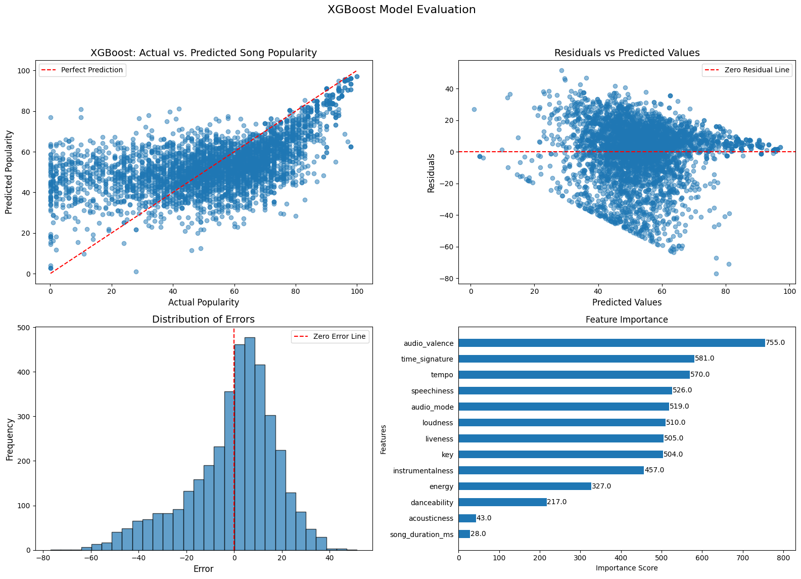

# Machine Learning Essay

[](https://opensource.org/licenses/MIT) 
[](https://www.python.org/downloads/release/python-3124/) 
[](https://github.com/Daniel-ASG/Intro_ML_CDS) 
[](https://github.com/Daniel-ASG/Intro_ML_CDS)

<a id='index'></a>
# Index

- [1. Introduction](#Introduction)
- [2. The Journey: A Deep Dive into Machine Learning Techniques](#The_Journey)
- [3. Project Structure](#Project_Structure)
- [4. Methodology](#Methodology)
- [5. Unveiling the Results](#Results)
    - [5.1. Customer Satisfaction Prediction](#Classification_Results)
    - [5.2. Song Popularity Forecasting](#Regression_Results)
    - [5.3. Wine Preference Clustering](#Clustering_Results)
- [6. Conclusion](#Conclusion)
- [7. Next Steps](#Next_Steps)
- [8. How to Use this Project](#How_to_Use_this_Project)
- [9. Author](#Author)

---

<a id='Introduction'></a>
## 1. Introduction

This repository documents a series of machine learning projects undertaken for Data Money, a fictional data science consultancy. These projects explore the power of various machine learning algorithms, aiming to provide insights and solutions for diverse business challenges. We delve into the worlds of customer satisfaction prediction, song popularity forecasting, and wine preference clustering, showcasing how data-driven solutions can be effectively applied across different industries. 

<a id='The_Journey'></a>
## 2. The Journey: A Deep Dive into Machine Learning Techniques

Our exploration of machine learning is presented through three distinct projects, each addressing a unique business problem. Each project represents a journey into the world of machine learning, demonstrating the following key aspects:

* **Hands-on Experience:** We gain practical experience by implementing and evaluating a range of classification, regression, and clustering algorithms. 
* **Performance Comparison:** By rigorously comparing algorithms and analyzing their performance, we gain valuable insights into which methods are best suited for specific tasks.
* **Actionable Insights:** We interpret model results and extract key insights that can inform strategic decision-making, transforming data into valuable business intelligence.

<a id='Project_Structure'></a>
## 3. Project Structure

This repository contains three Jupyter Notebooks, each representing a unique Data Money project:

* **[`classification.ipynb`](https://github.com/Daniel-ASG/Intro_ML_CDS/blob/main/Notebooks/Classification.ipynb)**: Predicting Customer Satisfaction - We partner with a leading airline to develop a model that predicts customer satisfaction based on travel experiences, enabling proactive service improvements and personalized offerings.
* **[`regression.ipynb`](https://github.com/Daniel-ASG/Intro_ML_CDS/blob/main/Notebooks/Regression.ipynb)**: Forecasting Song Popularity - We collaborate with a major music streaming platform to build a model that predicts song popularity based on audio features, empowering artists and labels to make strategic decisions about production, marketing, and playlist curation.
* **[`clustering.ipynb`](https://github.com/Daniel-ASG/Intro_ML_CDS/blob/main/Notebooks/Clustering.ipynb)**:  Unveiling Wine Preferences - We team up with a renowned wine producer to segment their portfolio and identify key characteristics that drive consumer preferences, guiding product development and marketing strategies.

The repository is structured as follows:

```
.
├── Data
│   ├── Classification/
│   ├── Clustering/
│   └── Regression/
├── Notebooks
│   ├── Classification.ipynb
│   ├── Clustering.ipynb
│   └── Regression.ipynb
├── README.md
├── Results/
└── requirements.txt
```

<a id='Methodology'></a>
## 4. Methodology

Our approach to each project follows a structured methodology:

1. **Data Preparation:**  We carefully prepare the data, including cleaning, feature engineering, and splitting into training, validation, and test sets.
2. **Algorithm Selection:** We select a range of relevant algorithms based on the nature of the problem and desired outcomes.
3. **Model Training and Tuning:** We train and fine-tune the selected algorithms using default parameters, followed by systematic hyperparameter optimization to achieve optimal performance.
4. **Performance Evaluation:** We rigorously evaluate the performance of the models on the training, validation, and test sets using appropriate metrics for each task.
5. **Insights Extraction:** We analyze the model results and derive key insights that can be used to inform business strategies and improve client outcomes.

<a id='Results'></a>
## 5. Unveiling the Results

Our machine learning experiments generated a wealth of insightful results, which we present in a series of tables, showcasing the performance of each algorithm across various tasks.

<a id='Classification_Results'></a>
### 5.1. Customer Satisfaction Prediction

**On the Training data**

| Algorithm        | Accuracy | Precision | Recall | F1-Score |
|-------------------|----------|-----------|--------|----------|
| KNN              | 0.9570   | 0.9576    | 0.9570 | 0.9569   |
| Decision Tree     | 1.0000   | 1.0000    | 1.0000 | 1.0000   |
| Random Forest     | 1.0000   | 1.0000    | 1.0000 | 1.0000   |
| Logistic Regression | 0.8753   | 0.8751    | 0.8753 | 0.8749   |
| XGBoost | 0.9781   | 0.9782    | 0.9781 | 0.9781   |

**On the Validation data**

| Algorithm        | Accuracy | Precision | Recall | F1-Score |
|-------------------|----------|-----------|--------|----------|
| KNN              | 0.9279   | 0.9296    | 0.9279 | 0.9274   |
| Decision Tree     | 0.9507   | 0.9509    | 0.9507 | 0.9506   |
| Random Forest     | 0.9446   | 0.9447    | 0.9446 | 0.9444   |
| Logistic Regression | 0.8756   | 0.8759    | 0.8310 | 0.8527   |
| XGBoost              | 0.9620   | 0.9709    | 0.9406 | 0.9555   |

**On the Test data**

| Algorithm            | Accuracy | Precision | Recall | F1-Score |
|---------------------|----------|-----------|--------|----------|
| KNN                 | 0.9294   | 0.9310    | 0.9294 | 0.9290   |
| Decision Tree       | 0.9554   | 0.9555    | 0.9554 | 0.9553   |
| Random Forest       | 0.9623   | 0.9624    | 0.9623 | 0.9622   |
| Logistic Regression | 0.8712   | 0.8710    | 0.8712 | 0.8709   |
| **XGBoost**        | **0.9626**   | **0.9628**    | **0.9626** | **0.9625**   |


Our classification experiments yielded compelling results, with **XGBoost** emerging as the top performer, achieving an impressive **accuracy of 96.3% on the test data**. This signifies its exceptional ability to accurately predict customer satisfaction based on the features analyzed.

<a id='Regression_Results'></a>
### 5.2. Song Popularity Forecasting

**On the Training data**

| Algorithm                          | R²      | RMSE      | MAE      | MAPE     | MPE         |
|------------------------------------|----------|-----------|----------|----------|-------------|
| Linear Regression                  | 0.0461  | 21.3541  | 16.9982  | 8.6532   | -842.08     |
| Decision Tree                      | 0.9918  | 1.9850   | 0.2141   | 0.0826   | -850.96     |
| Random Forest                      | 0.9028  | 6.8158   | 4.8608   | 2.5779   | -856.24     |
| Polynomial Regression              | 0.0942  | 20.8083  | 16.4580  | 8.3505   | -812.18     |
| Lasso Regression                   | 0.0074  | 21.7824  | 17.3055  | 8.7367   | -850.96     |
| Ridge Regression                   | 0.0461  | 21.3541  | 16.9983  | 8.6534   | -842.10     |
| ElasticNet Regression              | 0.0078  | 21.7777  | 17.2995  | 8.7323   | -850.96     |
| Polynomial Regression Lasso        | 0.0092  | 21.7632  | 17.2855  | 8.6997   | -850.96     |
| Polynomial Regression Ridge        | 0.0932  | 20.8201  | 16.4720  | 8.3727   | -814.50     |
| Polynomial Regression ElasticNet   | 0.0128  | 21.7228  | 17.2442  | 8.6788   | -850.96     |
| XGBoost                            | 0.7736  | 10.4037  | 7.6817   | 3.4780   | -851.07     |

**On the Validation data**

| Algorithm                          | R²      | RMSE      | MAE      | MAPE     | MPE         |
|------------------------------------|----------|-----------|----------|----------|-------------|
| Linear Regression                  | 0.0399  | 21.4114  | 17.0398  | 8.6825   | -845.13     |
| Decision Tree                      | 0.0636  | 21.1462  | 16.8435  | 8.3958   | -845.36     |
| Random Forest                      | 0.3410  | 17.7386  | 12.9303  | 7.0331   | -858.97     |
| Polynomial Regression              | 0.0665  | 21.1132  | 16.7499  | 8.5479   | -831.68     |
| Lasso Regression                   | 0.0399  | 21.4114  | 17.0398  | 8.6825   | -845.86     |
| Ridge Regression                   | 0.0399  | 21.4113  | 17.0393  | 8.6823   | -845.11     |
| ElasticNet Regression              | 0.0399  | 21.4114  | 17.0398  | 8.6825   | -845.86     |
| Polynomial Regression Lasso        | 0.0669  | 21.1088  | 16.7435  | 8.5618   | -845.88     |
| Polynomial Regression Ridge        | 0.0676  | 21.1008  | 16.7385  | 8.5603   | -832.97     |
| Polynomial Regression ElasticNet   | 0.0561  | 21.2299  | 16.8317  | 8.6552   | -846.06     |
| XGBoost                            | 0.0912  | 20.8323  | 16.5531  | 8.4874   | -846.02     |

**On the Test data**

| Algorithm                          | R²      | RMSE      | MAE      | MAPE     | MPE         |
|------------------------------------|----------|-----------|----------|----------|-------------|
| Linear Regression                  | 0.0512  | 21.4939  | 17.1442  | 8.5314   | -830.20     |
| Decision Tree                      | 0.0905  | 21.0440  | 16.8298  | 7.8832   | -847.59     |
| Random Forest                      | 0.4073  | 16.9883  | 12.1913  | 6.3176   | -861.50     |
| Polynomial Regression              | 0.0884  | 20.8712  | 16.5396  | 8.4228   | -819.23     |
| Lasso Regression                   | 0.0512  | 21.4939  | 17.1442  | 8.5314   | -849.31     |
| Ridge Regression                   | 0.0512  | 21.4939  | 17.1438  | 8.5324   | -830.30     |
| ElasticNet Regression              | 0.0512  | 21.4939  | 17.1442  | 8.5314   | -849.31     |
| Polynomial Regression Lasso        | 0.0873  | 20.8844  | 16.5516  | 8.4383   | -848.96     |
| Polynomial Regression Ridge        | 0.0883  | 20.8728  | 16.5415  | 8.4282   | -819.96     |
| Polynomial Regression ElasticNet   | 0.0613  | 21.1797  | 16.8022  | 8.5827   | -848.96     |
| **XGBoost**                        | **0.7118**  | **11.7349**  | **8.7977**  | **4.0081**   | **-849.05**     |



### **Notes:**
- XGBoost demonstrates the model's ability to provide a balance between bias and variance, resulting in an effective prediction of song popularity.

In our quest to predict song popularity, **XGBoost** again demonstrated its prowess, achieving an **R² of 0.712 on the test data**. This indicates that the model can explain approximately 70% of the variability in song popularity, suggesting a moderate but promising predictive ability. Additionally, the **RMSE of 11.73** signifies that, on average, the model's predictions deviate from the actual song popularity by approximately 11.73 points. This level of error is reasonable within the context of song popularity, reflecting the model's effectiveness while also highlighting areas for potential improvement.

<a id='Clustering_Results'></a>
### 5.3. Wine Preference Clustering

| Algorithm            | Silhouette Score | Number of Clusters |
|---------------------|:----------------:|:-----------------:|
| K-Means              |     0.2331      |        3          |
| K-Means with PCA     |     0.3281      |        3          |
| Affinity Propagation |     0.2238      |        3          |

Our clustering analysis focused on segmenting wines based on their chemical characteristics, employing both K-Means, K-Means with PCA and Affinity Propagation algorithms. Remarkably, both methods identified three distinct clusters with a high degree of agreement (Adjusted Rand Index between 0.951 and 0.758).  This suggests a robust and reliable segmentation of the wines. By leveraging these clusters, wine producers could potentially increase sales and customer satisfaction by offering products that are precisely aligned with distinct market segments.

<a id='Conclusion'></a>
## 6. Conclusion

This repository documents a series of successful machine learning projects, demonstrating Data Money's commitment to leveraging data science to solve real-world problems across diverse industries. Our exploration of customer satisfaction prediction, song popularity forecasting, and wine preference clustering has yielded valuable insights and provided a foundation for data-driven solutions that can empower businesses to thrive in today's data-driven world.

<a id='Next_Steps'></a>
## 7. Next Steps

To further enhance the models and analysis, we are considering the following steps:

* **Feature Engineering:** Explore and engineer new features based on domain knowledge and data exploration, potentially combining existing features or incorporating external data sources.
* **Advanced Algorithms:** Experiment with more sophisticated algorithms, such as gradient boosting methods (LightGBM) or neural networks, to potentially improve predictive performance.
* **Ensemble Techniques:** Investigate different ensemble techniques, beyond Random Forest and XGBoost, to combine the strengths of multiple models and further enhance accuracy and robustness.
* **Data Collection and Augmentation:** Gather additional data, especially for the regression task, to capture more factors that influence song popularity, such as social media engagement, marketing data, and expert reviews.
* **Deployment and Monitoring:** Deploy the models into a production environment, potentially creating a user interface or integrating them into existing systems for real-time predictions. Implement monitoring mechanisms to track model performance over time and retrain the models as needed to maintain accuracy.

<a id='How_to_Use_this_Project'></a>
## 8. How to Use this Project

This section guides you through exploring the notebooks of this project and understanding how they work.

**Prerequisites:**

- This project was developed using [Python](https://www.python.org/) version 3.12.4
- You need to have a Jupyter Notebook environment installed.

**Libraries:**

- [scikit-learn](https://scikit-learn.org/stable/)
- [statsmodels](https://www.statsmodels.org/stable/index.html)
- [pandas](https://pandas.pydata.org/)
- [matplotlib](https://matplotlib.org/)
- [seaborn](https://seaborn.pydata.org/)
- [plotly](https://plotly.com/python/getting-started/)

**Instructions:**

1. Clone this repository to your local machine: `git clone https://github.com/Daniel-ASG/Intro_ML_CDS.git`
2. Install the required libraries: `pip install -r requirements.txt`
3. Open the Jupyter Notebooks and run the cells. 


<a id='Author'></a>
## 9. Author

Made by Daniel Gomes. Feel free to reach out!

[](https://daniel-asg.github.io/portfolio_projetos/)
[](mailto:daniel.alexandre.eng@gmail.com)
[](https://www.linkedin.com/in/daniel-asgomes)
